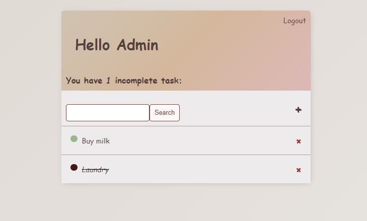
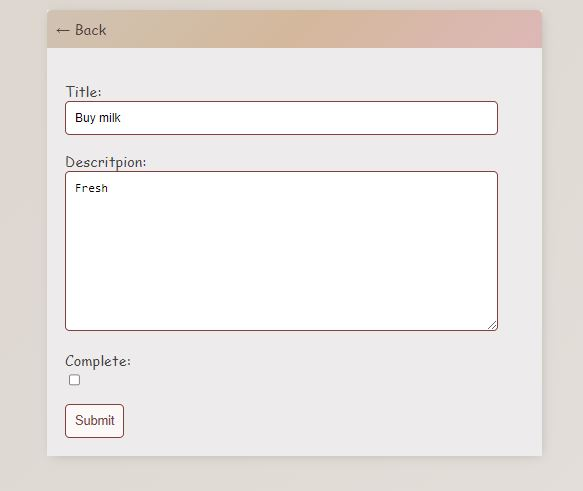

# Installation
* 1 - clone repo https://github.com/PPysklo/To-Do.git
* 2 - create a virtual environment and activate
*  - pip install virtualenv
*  - virtualenv envname
*  - envname\scripts\activate
* 3 - cd into project "cd To-Do"
* 4 - pip install -r requirements.txt
* 5 - python manage.py runserver

# Home Page

# Task form

